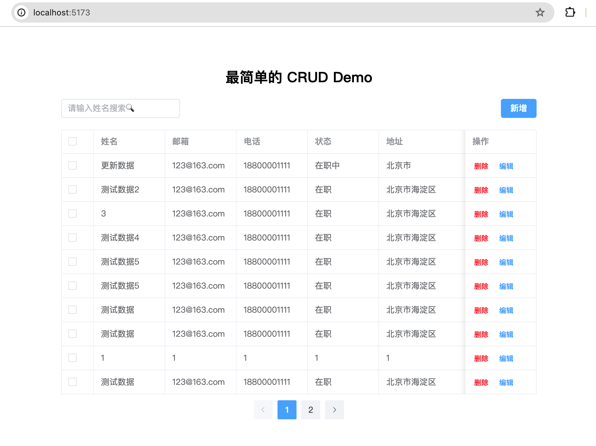
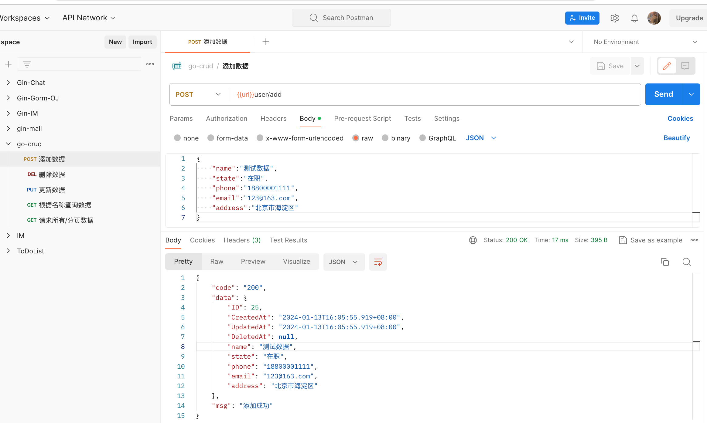
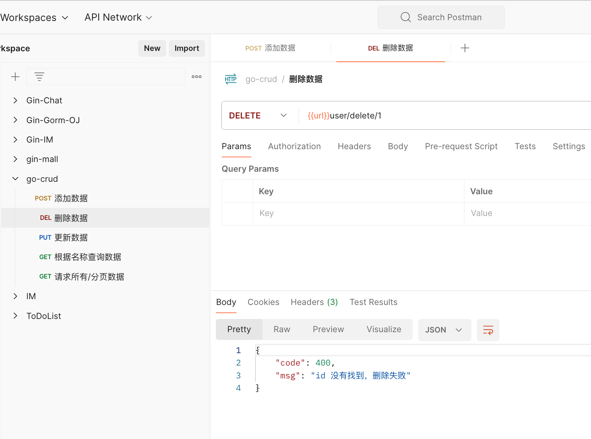
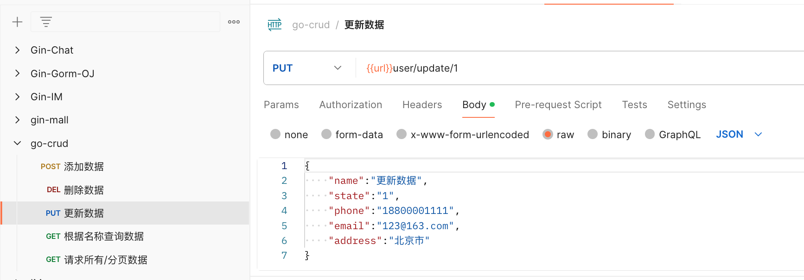
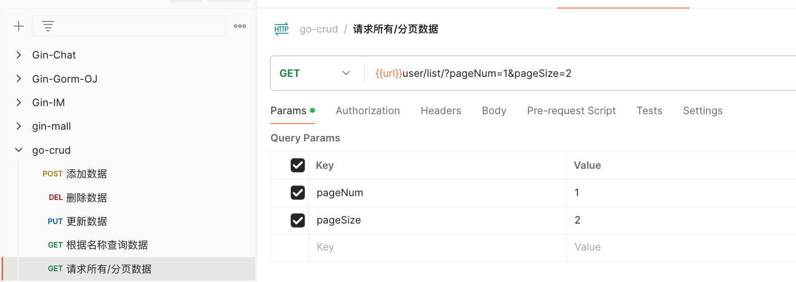

# 最简单的 CRUD Demo 

## 前端：使用 Vue 3.3 + Vite + js + Element-Plus + Axios 实现

## 后端 : Go 1.21 + Gin + GORM + Mysql

所需环境

Node.js 21.3.0
Go      1.21
MySQL   8.0.27

已经实现的功能

前端 CRUD
后端 CRUD


创建 MySQL 数据库
```sql
create schema crud collate utf8mb4_0900_ai_ci;

```

```shell
# 启动前端
yarn dev

# 启动后端服务
go run main.go


# 编译前端
yarn build


# 编译后端

GOOS=linux GOARCH=amd64 go build -o curd_linux64 main.go

```


浏览器访问：

http://localhost:5173/


运行效果：



Postman 测试：










